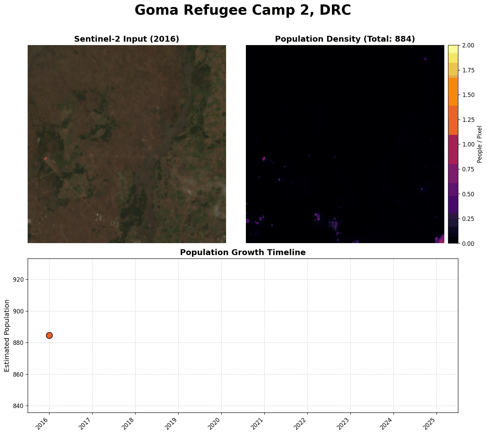

# Bourbon 🥃: Distilled Population Maps

**Bourbon** is a lightweight, distilled version of the [POPCORN](https://github.com/prs-eth/Popcorn) model for population estimation from Sentinel-2 satellite imagery only. By "distilling" over several Bag-Of-Popcorns maps into a compact backbone, Bourbon delivers fast, accurate inference suitable for large-scale mapping. We also provide a all-in-one version of the model the fetches imagery and performs inference in one command.

> **Fun Fact:** Why "Bourbon"? Because it's what you get when you distill (Pop)Corn! 🌽➡️🥃


## Quantitative Evaluation

We evaluated **Bourbon** on the Rwanda benchmark, comparing it against state-of-the-art models. Despite being a lightweight, distilled model using only Sentinel-2 imagery, Bourbon outperforms previous baselines, including the original Teacher model (Bag-of-Popcorn), achieving an **R² of 70** and the lowest **MAE (8.3)** and **RMSE (18.9)**.


## Technical Details

Bourbon is distilled from **Bag-Of-Popcorn**, an ensemble model trained on **only weakly supervised samples** (Census block counts).

1.  **Teacher Model (Bag-Of-Popcorn)**:
    *   **Ensemble**: We aggregate predictions from 5 distinct ensemble members.
    *   **Temporal Augmentation**: Each member inferences on 4 seasonal median composites (Spring, Summer, Autumn, Winter), resulting in 20 total predictions per location.
    *   **Architecture**: Each teacher member uses the full **Dual-Stream Backbone** (one for Occupancy Rate, one for Building Extraction), with separate branches for **Sentinel-1** and **Sentinel-2**.

2.  **Student Model (Bourbon)**:
    *   **Architecture**: A compact, single-stream **ResNet** backbone that relies purely on **Sentinel-2** (no dependency on Sentinel-1). The Sentinel-1 branch is unused, leaving only **~19k active parameters** (approx. 1/4 the size of a teacher).
    *   **Distillation**: The student is trained to mimic the teacher's averaged "pseudolabels" over Rwanda using a **LogL1 Loss**.
    *   **Training**: We employ a curriculum learning strategy, starting with non-empty patches and gradually introducing unpopulated regions. The process is extremely efficient -- distillation takes only **40 epochs** (~6 minutes).


## Contents

*   `model/`: Contains the model architecture definitions.
*   `hubconf.py`: Configuration for `torch.hub`.
*   `predict_from_coords.py`: Command-line tool for fetching imagery and generating population maps.
*   `requirements.txt`: Dependencies.

## Installation

Please install the dependencies using the following command:
```bash
pip install -r requirements.txt
```

or use the following commands:
```bash
pip install torch numpy matplotlib requests rasterio
```

For fetching satellite imagery, please install the following dependencies. For Microsoft Planetary Computer:
```bash
pip install pystac-client planetary-computer stackstac rioxarray
```
For Google Earth Engine:
```bash
pip install earthengine-api
```

## Quick Start (Command Line)

Generate a population map for Kigali, Rwanda:

```bash
python predict_from_coords.py \
  --lat -1.9441 --lon 30.0619 \
  --size 512 \
  --provider mpc \
  --ensemble 10 \
  --output kigali_bourbon.png
```


We recommend using Microsoft Planetary Computer (--provider mpc) for fetching satellite imagery, as it does not require an API key and is free to use. Alternatively, you can use Google Earth Engine (--provider gee).

## Nowcasting & Time Series (`predict_timeseries.py`) 📈

Bourbon can track population trends over time by "nowcasting" across satellite archives at regular intervals (default: every 6 months).

**Example (2016-2025 growth analysis):**
```bash
python predict_timeseries.py \
  --lat -1.9441 --lon 30.0619 \
  --size_meters 2000 \
  --ensemble 3 \
  --out_dir kigali_growth \
  --vmax 1.5
```

**Note**: Use `--vmax` to set a constant scale for the population maps. This is highly recommended for time-series GIFs to ensure the density intensities are visually comparable across years.

**Outputs:**
*   `population_growth.gif`: An animated time-lapse of population expansion.
*   `growth_curve.png`: A plot of the population trend line.
*   `population_timeseries.csv`: Data spreadsheet (Date, Count).
*   `frame_XXX.png`: Individual snapshots for each time step.

## Python Usage (TorchHub)

Bourbon is designed for simplicity. You can load it and run inference in 3 lines of code.

### 1. Load the Model

```python
import torch

# Load Bourbon (pretrained on Rwanda)
model = torch.hub.load('nandometzger/bourbon', 'bourbon', pretrained=True)
if torch.cuda.is_available(): model.cuda()
elif torch.backends.mps.is_available(): model.to('mps')
```

### 2. Run Inference (Two Ways)

**Option A: End-to-End from Coordinates**
Automatically fetches imagery (from Microsoft Planetary Computer) and predicts.

```python
# Predict for Kigali (returns dict with maps and counts)
# Note: Requires MPC dependencies installed
result = model.predict_coords(lat=-1.9441, lon=30.0619, size_meters=5000, ensemble=10)

print(f"Population: {result['pop_count']:.2f}")

# Access results
pop_map = result['pop_map'] # (H, W) array
if 'std_map' in result:
    uncert = result['std_map'] # Uncertainty
```

**Option B: From Satellite Image**
If you have your own Sentinel-2 image (Numpy array, 4 channels: R,G,B,N).

```python
import numpy as np
# Your image: (4, H, W) float32 array (Rough range 0-10000)
img = ... 

# Predict (Handles normalization automatically!)
result = model.predict(img)

print(f"Population: {result['pop_count']:.2f}")
```


## Bourbon Discovery 🥃

Try Bourbon on interesting urban growth sites with a single command:

**🏙️ Kigali, Rwanda (Modern Development)**
```bash
python predict_timeseries.py --name "Kigali" --lat -1.9470 --lon 30.0740 --size_meters 20000 --vmax 1.5
```


**🏙️ Bunia, DRC (Urban expansion & Refugee Camp)**
```bash
python predict_timeseries.py --name "Bunia" --lat 1.5573 --lon 30.2412 --size_meters 10000 --vmax 1.0
```


**🏙️ Geita, Tanzania (Rapid Growth)**
```bash
python predict_timeseries.py --name "Geita" --lat -2.8778 --lon 32.2301 --size_meters 10000 --vmax 2.0
```


**🏙️ Gitega, Burundi (Capital Expansion)**
```bash
python predict_timeseries.py --name "Gitega" --lat -3.4278 --lon 29.9248 --size_meters 10000 --vmax 2.0
```


**🏙️ Hoima, Uganda (Oil City)**
```bash
python predict_timeseries.py --name "Hoima" --lat 1.4331 --lon 31.3501 --size_meters 10000 --vmax 2.0
```


**🏙️ Mwanza, Tanzania (Lakeside City)**
```bash
python predict_timeseries.py --name "Mwanza" --lat -2.5178 --lon 32.9018 --size_meters 10000 --vmax 2.0
```


**⛺ Nakivale, Uganda (Refugee Settlement)**
```bash
python predict_timeseries.py --name "Nakivale" --lat -0.7783 --lon 30.9471 --size_meters 5000 --vmax 2.0
```


**⛺ Goma, DRC (Refugee Camp 1 - Cloudy)**
```bash
python predict_timeseries.py --name "Goma Camp 1" --lat -1.5987 --lon 29.1728 --size_meters 3000 --vmax 2.0
```


**⛺ Goma, DRC (Refugee Camp 2 - Cloudy)**
```bash
python predict_timeseries.py --name "Goma Camp 2" --lat -1.6172 --lon 29.2380 --size_meters 3000 --vmax 2.0
```


**🏙️ Musanze, Rwanda**
```bash
python predict_timeseries.py --name "Musanze" --lat -1.5009 --lon 29.6290 --size_meters 10000 --vmax 2.0
```

